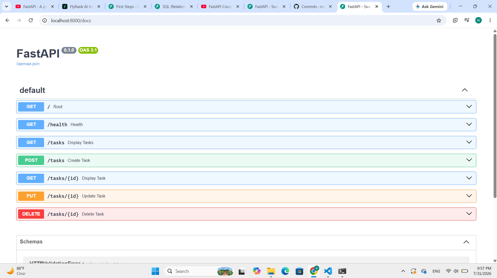

# Task API — CRUD To-Do List

A simple in-memory CRUD API for managing a to-do list, built with **Python + FastAPI** as part of the W2 · A1 assignment.

No database is used — all tasks live in a Python list in memory, so data resets whenever the server restarts.

---

## How to install & run

**1. Install dependencies:**
```bash
python -m pip install fastapi uvicorn
```

**2. Run the server:**
```bash
uvicorn main:app --reload
```

The API will be available at `http://127.0.0.1:8000`.

Interactive Swagger UI (auto-generated docs + "Try it out") is available at:
```
http://127.0.0.1:8000/docs
```

---

## Endpoints

| Method | Path            | Description                          | Success | Errors             |
|--------|-----------------|--------------------------------------|---------|---------------------|
| GET    | `/`             | API info (name, version, endpoints)  | 200     | —                   |
| GET    | `/health`       | Health check                         | 200     | —                   |
| GET    | `/tasks`        | List all tasks                       | 200     | —                   |
| GET    | `/tasks/{id}`   | Get a single task by id               | 200     | 404 unknown id      |
| POST   | `/tasks`        | Create a new task                    | 201     | 400 missing/empty title |
| PUT    | `/tasks/{id}`   | Update a task's title and/or done    | 200     | 400 empty title, 404 unknown id |
| DELETE | `/tasks/{id}`   | Delete a task                        | 204     | 404 unknown id      |

Each task has the shape:
```json
{ "id": 1, "title": "docker course", "done": true }
```

---

## Example request

Ran via PowerShell's `Invoke-WebRequest` (equivalent to `curl -i`) due to a quoting incompatibility between PowerShell and `curl.exe` on this machine:

```
POST /tasks
Body: {"title":"Buy milk"}

HTTP/1.1 201 Created
Content-Length: 40
Content-Type: application/json
Date: Fri, 31 Jul 2026 19:10:48 GMT
Server: uvicorn
{"id":6,"title":"Buy milk","done":false}
```

---

## Swagger UI

Full CRUD cycle tested and working via Swagger UI's "Try it out":



*(Screenshot: all 7 endpoints listed at `/docs` — GET /, GET /health, GET /tasks, POST /tasks, GET /tasks/{id}, PUT /tasks/{id}, DELETE /tasks/{id})*

---

## Notes

- Data is stored in memory only — restarting the server resets the task list back to the 3 seed tasks.
- Validation: creating or updating a task with a missing or empty (or whitespace-only) title returns `400`.
- Requesting an unknown task id returns `404` with a JSON error message.
